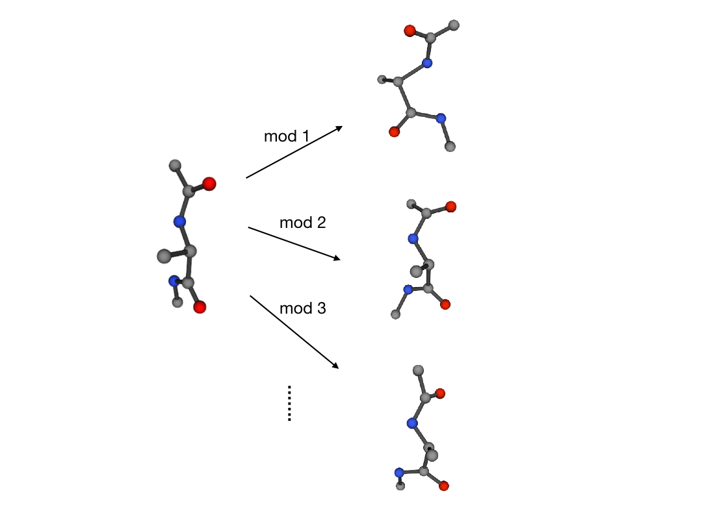

<div align="center">

</div>


PyTorch implement of the paper [Neural Canonical Transformation with Symplectic Flows](https://arxiv.org/abs/1910.00024). 

A symplectic normalizing flow learns slow and nonlinear collective modes in the latent space. The model reveals dynamical information from statistical correlations in the phase space. 

## Usage

### 0. Setup Guide

Both  [`pytorch`](https://pytorch.org/) and [`numpy`](https://numpy.org/) are required, you can install them using [`anaconda`](http://anaconda.org).

*If you want to run the following demos, you need to download savings and datasets from Google Drive. To do this run:*

```bash
python download_demo.py
```

### 1. Phase Space Density Estimation

#### 1.1 Molecular Dynamics trajectory data

To train a neuralCT for molecular dynamics data, use `density_estimation_md.py`
```bash
python ./density_estimation_md.py -batch 200 -epoch 500 -fixy 2.3222 -dataset ./database/alanine-dipeptide-3x250ns-heavy-atom-positions.npz
```

**Key Options**

- **-cuda**: Which device to use with -1 standing for CPU, number bigger than -1 is N.O. of GPU;
- **-hdim**: Hidden dimension of mlps;
- **-numFlow**: Number of flows layers;
- **-nlayers**: Number of mlps layers in the rnvp;
- **-nmlp**: Number of dense layers in each mlp;
- **-smile**: SMILE expression of this molecular;
- **-dataset**: Path to the training data.

To see detailed options, run `python density_estimation_md.py -h`.

**Analysis Notebook** 

[Alanine Dipeptide](3_AlanineDipeptide.ipynb)



#### 1.2  Image dataset

To train a neuralCT for machine learning dataset, use `density_estimation.py`. 
```bash
python ./density_estimation.py -epochs 5000 -batch 200 -hdim 256 -nmlp 3 -nlayers 16 -dataset ./database/mnist.npz
```

**Key Options**

- **-cuda**: Which device to use with -1 standing for CPU, number bigger than -1 is N.O. of GPU;
- **-hdim**: Hidden dimension of mlps;
- **-numFlow**: Number of flows layers;
- **-nlayers**: Number of mlps layers in the rnvp;
- **-nmlp**: Number of dense layers in each mlp;
- **-n**: Number of dimensions of the training data;
- **-dataset**: Path to the training data.

To see detailed options, run`python density_estimation.py -h`.

**Analysis Notebook**

[MNIST concept compression](4_MNIST.ipynb)


### 2. Variational Free Energy Calculation

To train a neuralCT via the variational approach, use `variation.py`. Specify the name of the distribution with the  **-source** option. 

```bash
python ./variation.py -epochs 5000 -batch 200 -hdim 256 -nmlp 3 -nlayers 16 -source Ring2d
```

**Key Options**

- **-cuda**: Which device to use with -1 standing for CPU, number bigger than -1 is N.O. of GPU;
- **-hdim**: Hidden dimension of mlps;
- **-numFlow**: Number of flows layers;
- **-nlayers**: Number of mlps layers in the rnvp;
- **-nmlp**: Number of dense layers in each mlp;
- **-source**: Using which source, Ring2d or HarmonicChain.

To see detailed options, run `python variation.py -h`.

**Analysis Notebooks**

1. [Ring2D distribution](1_Ringworld.ipynb)
2. [Harmonic Chain](2_HarmonicChain.ipynb)

## Citation

````latex
@article{neuralCT,
  Author = {Shuo-Hui Li, Chen-Xiao Dong, Linfeng Zhang, and Lei Wang},
  Title = {Neural Canonical Transformation with Symplectic Flows},
  Year = {2019},
  Eprint = {arXiv:1910.00024},
}
````

## Contact

For questions and suggestions, please contact Shuo-Hui Li at [contact_lish@iphy.ac.cn](mailto:contact_lish@iphy.ac.cn).
